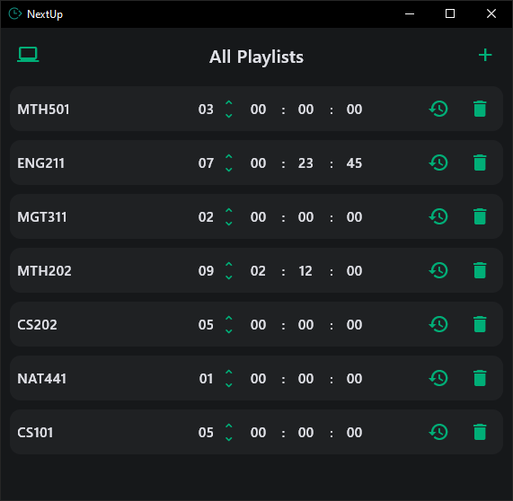

# NextUp

A simple and intuitive playlist manager that helps you keep track of your video playlists and viewing progress.

## Features

- **Add and manage playlists**: Create multiple playlists with custom names
- **Track viewing progress**: Keep track of which video you're on and your timestamp (hours, minutes, seconds)
- **Persistent storage**: Your playlists and progress are automatically saved
- **Clean interface**: Simple, easy-to-use design
- **Cross-platform**: Works on Windows, Linux, and as a Python application

## Screenshot



Figure: A quick look at NextUp's main UI — add playlists, set video number and timestamp.

## How to Use

### Windows

1. Download the `NextUp.exe` file from the `windows/` folder
2. Double-click to run the application
3. That's it! No installation required

### Linux

1. Download the `NextUp` file from the `linux/` folder
2. Make it executable: `chmod +x NextUp`
3. Run it: `./NextUp`

### Python (All Platforms)

If you prefer to run the Python version or want to modify the code:

1. **Create a virtual environment:**
   ```bash
   python -m venv nextup_env
   ```

2. **Activate the virtual environment:**
   - On Windows: `nextup_env\Scripts\activate`
   - On Linux/Mac: `source nextup_env/bin/activate`

3. **Install the required library:**
   ```bash
   pip install flet
   ```

4. **Run the application:**
   ```bash
   python python_files/main.py
   ```

## Using the Application

1. **Add a playlist**: Click the "+" button and enter your playlist name
2. **Set your progress**: Use the stepper to set which video you're on
3. **Track your time**: Enter hours, minutes, and seconds where you left off
4. **Your data is saved automatically** when you close the application

Enjoy keeping track of your playlists with NextUp!